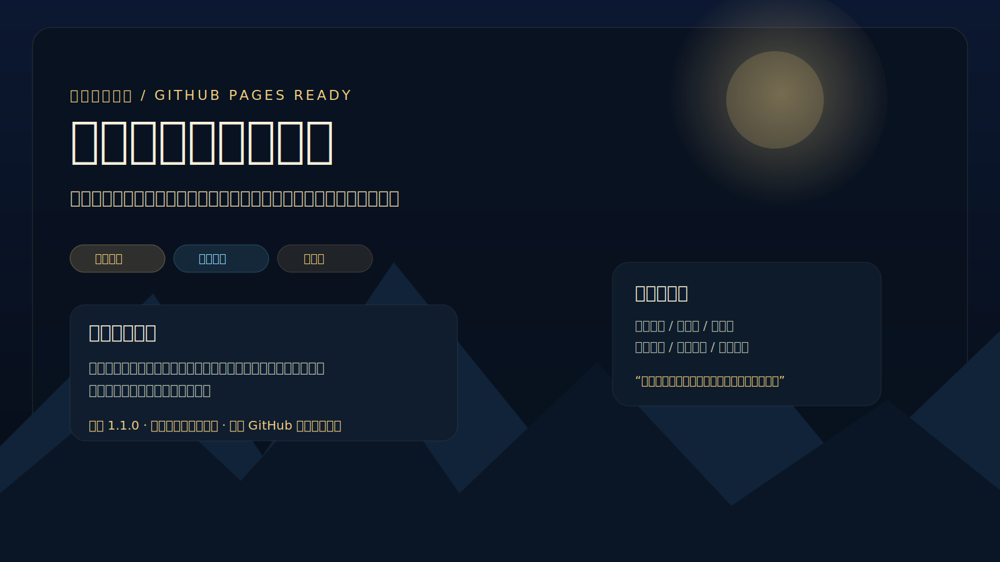
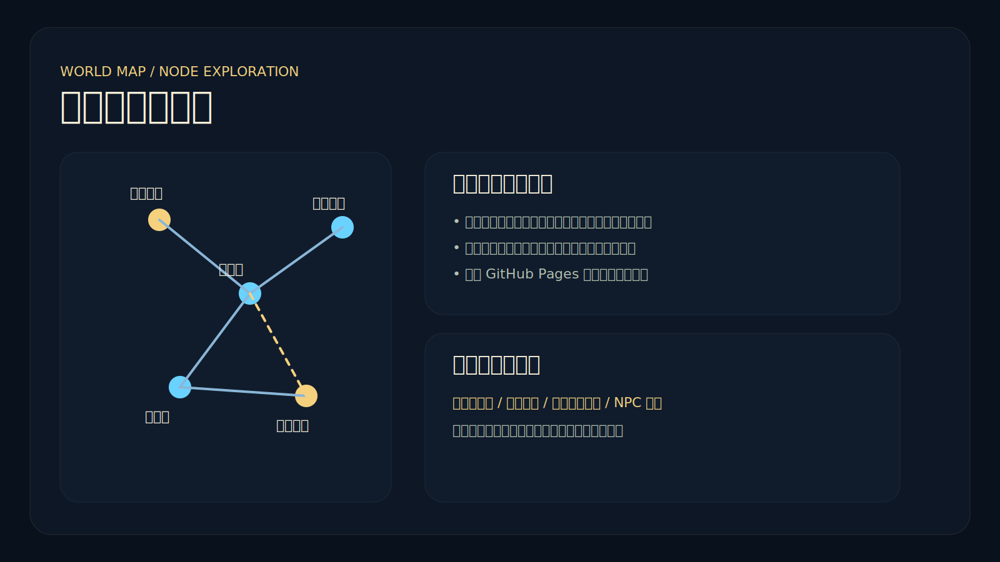
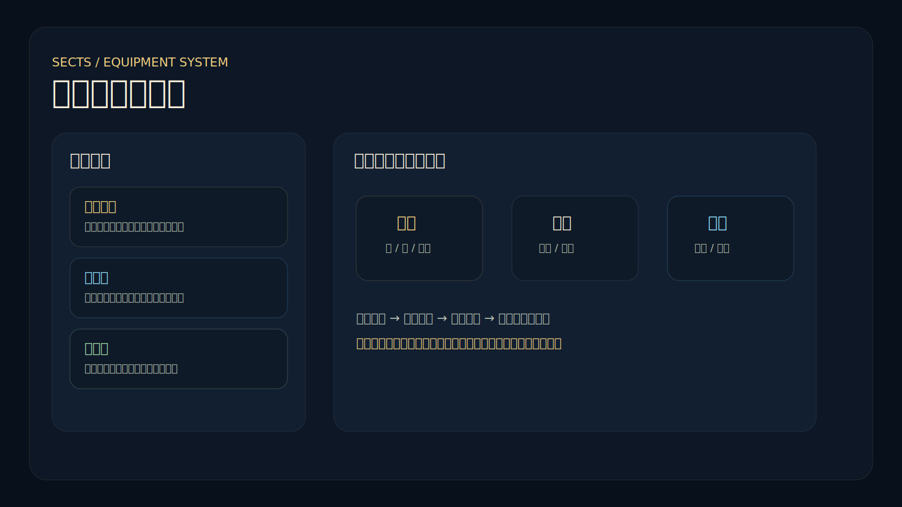
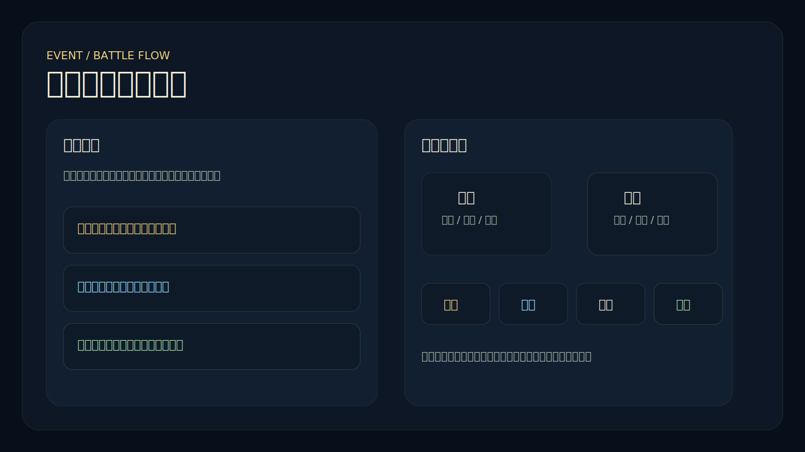

# 一念穿越：江湖初卷


一个可直接推送到 **GitHub 新仓库** 并通过 **GitHub Pages** 发布的武侠穿越 HTML5 页游项目。

- **仓库名建议**：`transmigrator-wuxia`
- **项目展示名**：**一念穿越：江湖初卷**
- **首发世界**：武侠世界「大晟江湖」
- **发布定位**：正式静态项目仓库，不是 demo、样例或教学脚手架

> 现代灵魂坠入风雨江湖，在门派试探、夜市暗线与界门异象之间，走出属于自己的第一段穿越旅程。

---

## 项目亮点

- **可直接上线**：纯前端静态站点，默认支持 GitHub Pages
- **主界面成型**：中央游戏区 + 右侧情报区 + 底部按钮栏 + 统一弹窗系统
- **闭环玩法**：剧情事件、节点探索、轻战斗、门派成长、装备获取、多结局
- **仓库完整**：包含文档、Issue/PR 模板、校验脚本、打包脚本、发布工作流
- **可持续扩展**：武侠世界已配置化，后续可继续扩展诸天世界

---

## 当前版本

- **版本号**：`1.5.0`
- **主界面特性**：主界面、创建角色页、事件页、战斗页统一为 UMD 线条界面，侧边小三角抽屉贯通人物、背包、技能、地图、商场、公告与后台窗口
- **版本页**：[`version.html`](./version.html)
- **变更记录**：[`CHANGELOG.md`](./CHANGELOG.md)
- **部署说明**：[`docs/DEPLOYMENT.md`](./docs/DEPLOYMENT.md)
- **架构说明**：[`docs/ARCHITECTURE.md`](./docs/ARCHITECTURE.md)

---

## 发布页截图

> 以下图片为仓库内置的发布页展示图，可直接用于 GitHub README、Release 说明或项目介绍页。

### 首屏 / 品牌展示


### 世界地图 / 探索流程


### 主界面 / 弹窗系统


### 事件与战斗页


---

## 已实现内容

### 游戏系统
- 创建角色
- 世界地图探索
- 剧情与奇遇事件
- 轻回合制战斗
- 门派系统
  - 天岳剑宗
  - 玄衣楼
  - 药王谷
- 装备系统
  - 武器
  - 护甲
  - 饰品
- 城镇与商店交互
- 本地存档与导入导出
- 多结局收束
- 统一道具库 / 装备库
- 装备实例化存储与属性联动
- 游戏内公告与后台窗口

### 工程与仓库
- GitHub Pages 自动部署工作流
- 仓库规范文件
  - `LICENSE`
  - `CHANGELOG.md`
  - `CONTRIBUTING.md`
  - `SECURITY.md`
  - `ROADMAP.md`
- Issue / PR 模板
- 数据校验脚本
- 发布打包脚本
- 版本页与发布截图资源

---

## 技术栈

- **Phaser 3**
- **原生 JavaScript**
- **UMD 风格命名空间**
- **JSON 配置驱动**
- **localStorage 存档**
- **GitHub Actions + GitHub Pages**

---

## 目录结构

```text
transmigrator-wuxia/
├─ index.html
├─ version.html
├─ 404.html
├─ README.md
├─ LICENSE
├─ CHANGELOG.md
├─ CONTRIBUTING.md
├─ SECURITY.md
├─ ROADMAP.md
├─ package.json
├─ .gitignore
├─ .editorconfig
├─ .gitattributes
├─ .nojekyll
├─ assets/
│  ├─ data/
│  │  └─ worlds/
│  │     └─ wuxia/
│  │        ├─ world.json
│  │        ├─ maps.json
│  │        ├─ events.json
│  │        ├─ npcs.json
│  │        ├─ itemLibrary.json
│  │        ├─ equipmentLibrary.json
│  │        ├─ announcements.json
│  │        ├─ skills.json
│  │        └─ enemies.json
│  ├─ icons/
│  │  └─ favicon.svg
│  └─ meta/
│     └─ version.json
├─ css/
├─ js/
├─ docs/
│  ├─ DEPLOYMENT.md
│  ├─ ARCHITECTURE.md
│  ├─ CONTENT_PIPELINE.md
│  └─ screenshots/
├─ scripts/
│  ├─ validate_assets.py
│  └─ release_zip.py
└─ .github/
   ├─ workflows/
   │  ├─ deploy-pages.yml
   │  └─ validate-project.yml
   ├─ ISSUE_TEMPLATE/
   └─ PULL_REQUEST_TEMPLATE.md
```

---

## 快速开始

### 1. 新建 GitHub 仓库

建议仓库名使用：

```text
transmigrator-wuxia
```

### 2. 推送代码

```bash
git init
git add .
git commit -m "feat: initial public release"
git branch -M main
git remote add origin <你的仓库地址>
git push -u origin main
```

### 3. 本地启动

任选一种：

```bash
python3 -m http.server 8080
```

或：

```bash
npx serve . -l 8080
```

打开：

```text
http://localhost:8080/
```

---

## GitHub Pages 发布

项目已经内置：

```text
.github/workflows/deploy-pages.yml
```

在 GitHub 仓库中：
- 打开 `Settings`
- 打开 `Pages`
- 将 `Source` 设为 **GitHub Actions**

部署完成后访问：

```text
https://<你的用户名>.github.io/transmigrator-wuxia/
```

如果仓库名称不是 `transmigrator-wuxia`，请同步修改：
- README 中的访问地址
- `package.json` 中的 repository url

---

## 维护命令

### 校验配置数据

```bash
python3 scripts/validate_assets.py
```

### 重新打包发布 ZIP

```bash
python3 scripts/release_zip.py
```

---

## 内容说明

### 地图区域
- 断瓦破庙
- 青石镇
- 黑风山
- 洛川古道
- 夜市渡口
- 天岳山门
- 药王谷外谷

### 门派
- **天岳剑宗**：剑路正统，成长稳定
- **玄衣楼**：暗线推进，偏潜行与谋略
- **药王谷**：恢复、经脉、医毒路线

### 装备槽位
- 武器
- 护甲
- 饰品

### 核心循环
创建角色 → 地图探索 → 事件分支 → 战斗 / 城镇 → 门派成长 → 终局结算

---

## 品牌文案（可直接用于仓库简介 / Release 标题）

### 仓库简介短句
> 一个可直接部署到 GitHub Pages 的武侠穿越 HTML5 页游项目。

### 首页副标题
> 第一世界已经开启。你会成为宗师、棋手，还是找到回到现代的裂隙？

### 发布页一句话介绍
> 在大晟江湖中完成你的第一次穿越：探索、结交、习武、入局，并决定自己留下的名字。

---

## 版本与存档

当前版本：`1.1.0`

当前存档键：

```text
transmigrator_wuxia_save_v110
```

如果你修改了玩家结构、门派结构或事件状态结构，请同步升级存档键，避免旧存档污染新版本。

---

## 后续扩展建议

### 内容扩展
- 增加门派专属任务链
- 增加 NPC 好感系统
- 增加隐藏结局
- 增加世界切换入口

### 工程扩展
- 引入自动化测试
- 增加音效与资源预加载规范
- 补充版本发布流水线
- 后续按需切换 TypeScript 或构建工具
